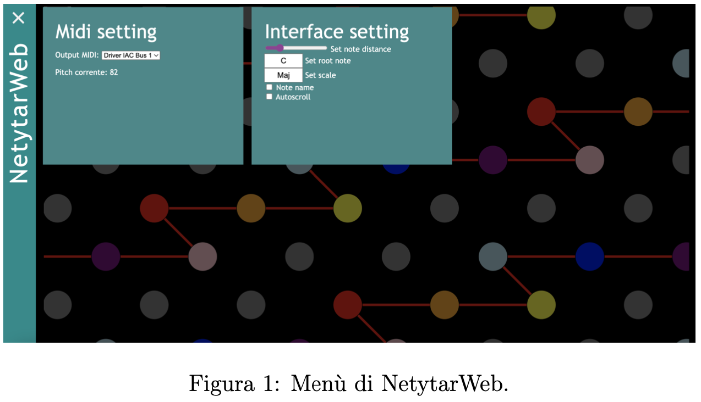
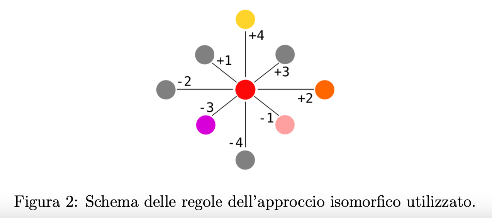

# NetytarWeb

    Prova l'interfaccia:
  <a href="https://annafusari.github.io/netytarweb/">NetytarWeb</a>

  Questo elaborato ha lo scopo di implementare la versione web di Netytar, uno strumento musicale digitale accessibile (ADMI) da persone con disabilità motoria tetraplegica. 

  Questo strumento si basa sul concetto di gaze pointing: l’interfaccia è stata realizzata per consentire al musicista di selezionare i tasti tramite il movimento dello sguardo, in modo tale da utilizzare un canale di interazione che possa superare i limiti fisici imposti da alcuni tipi di disabilità. In particolare, questo strumento è rivolto a tutti gli utenti affetti da tetraplegia, ovvero una paralisi che coinvolge tutto il corpo a partire dalle spalle in giù.

 L’interfaccia è formata da una griglia di tasti circolari colorati rappresentanti le note. Ogni colore è associato a una nota diversa, le linee uniscono gli elementi dell’interfaccia andando a formare una scala, maggiore o minore, a partire dalla nota di riferimento. Vale la pena soffermarsi sul fatto che l’applicazione utilizza la Web MIDI API per comunicare con i dispositivi MIDI messi a disposizione dal client. Essa non rappresenta ancora uno standard ma è stata scelta come soluzione perchè garantisce all’utente la massima libertà di espressione, dandogli la possibilità di utilizzare i suoni forniti direttamente dai sintetizzatori installati sulla propria macchina. Per fare in modo che l’applicazione comunichi un messaggio di NoteOn o NoteOff bisogna premere e rilasciare il tasto “P”. E` possibile suonare dei legati selezionando note diverse senza rilasciare il tasto. La performance delle note può essere affidata ad un sensore a fiato sviluppato tramite Arduino, che permette di suonare utilizzando il soffio. Il suo utilizzo è permesso da un’applicazione middleware in grado di gestire gli input del sensore e sostituirli alla pressione del tasto “P”, al tempo stesso inviando segnali MIDI channel pressure in grado di gestire la dinamica del suono.

    

  L’interfaccia presenta un menù a scomparsa, come si vede nella Fig. 1, che contiene due tipi di comandi, quelli relativi alla gestione delle porte MIDI disponibili e quelli relativi alla griglia di tasti. Questa scelta è stata eseguita per lasciare la maggior quantità di spazio all’estensione della griglia di tasti.

  Per quanto riguarda le impostazioni relative alla griglia `e possibile modificare la distanza tra i tasti, impostare la nota di riferimento e la scala, scelta tra maggiore e minore, aggiungere il nome della nota al di sotto del tasto corrispondente e attivare la modalita` di autoscrolling. Quest’ultima permette all’utente di navigare la tastie- ra in maniera fluida attraverso il gaze pointing, consentendo di raggiungere note non rappresentate a schermo in un dato istante.

    

  La griglia di tasti `e stata progettata con un layout isomorfico: a ogni nota corrispon- dono otto elementi adiacenti, la cui posizione rispetto alla nota di riferimento, definisce l’incremento o il decremento in semitoni, come mostrato dalla Fig. 2. Grazie a questo tipo di layout una trasposizione di scala, accordo o brano musicale non causa nessun cambiamento di forma nel percorso da effettuare.

  Per suonare NetytarWeb attraverso il movimento degli occhi è necessario dotarsi di un eye tracker. Durante lo sviluppo del progetto è stato utilizzato Tobii Eye Tracker 5. Con esso viene fornito un software per la calibrazione del dispositivo. Grazie a un’applicazione middleware esso si sostituisce al cursore del mouse, opzione attivabile dalla pressione del tasto “L”.

## Utilizzare NetytarWeb
<h3>Requisiti hardware</h3>

Per utilizzare NetytarWeb `e neccessario essere in possesso di:

<ul>
    <li>un computer connesso alla rete internet e munito di browser compatibile.</li>
    <li>un sensore a fiato realizzato con Arduino, istruzioni per la sua costruzione sono disponibili su: https: //github.com/Neeqstock/NeeqSensors</li>
    <li>un dispositivo Tobii Eye Tracker (ad oggi compatibile solo con il sistema operativo Windows)</li>
</ul>

<h3>Requisiti software</h3>

Per utilizzare NetytarWeb `e necessario installare i seguenti software sul proprio computer:

<ul>
    <li>E` particolarmente consigliato Google Chrome.</li>
    <li>Tobii Drivers (https://gaming.tobii.com/getstarted/)</li>
    <li>applicazione middleware per l’utilizzo del sensore a fiato, disponibile su:
     https://github.com/Neeqstock/NetytarWebController</li>
    <li>sintetizzatore software o una DAW che mette a disposizione una libreria di suoni:
        <ul>
        <li>sistema operativo Apple: `e possibile utilizzare Garageband (https: //www.apple.com/it/mac/garageband/) e impostare le porte MIDI tramite driver IAC (Impostazioni/Configurazioni MIDI audio/finestra/- Mostra studio MIDI)
            <li>sistema operativo Windows: `e possibilie utilizzare LoopMidi (https:// www.tobias-erichsen.de/software/loopmidi.html) per creare una connessione MIDI virtuale sulla macchina. Tramite VSTHost (https: //www.hermannseib.com/english/vsthost.htm) `e possibile caricare plugin VST, molti dei quali sono reperibili gratuitamente sul sito Plu- gins4Free (https://plugins4free.com/).</li></ul>
</li>

</ul>

